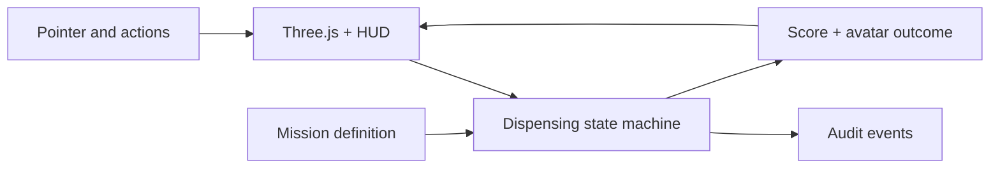

# Architecture

The game separates simulation rules from rendering so safety-critical progression can be tested without a GPU or browser.

## State invariants

1. A mission cannot accept materials before prescription verification.
2. A hazardous contaminant ends the current run.
3. An out-of-order selection never advances progression.
4. Packaging and labeling are part of mission completion.
5. Completion restores the simulated patient outcome only after every required step.

## Rendering strategy

Three.js is the web renderer. The domain engine contains no browser APIs. This leaves a clean path for a later native renderer using Google Filament without duplicating gameplay rules.
