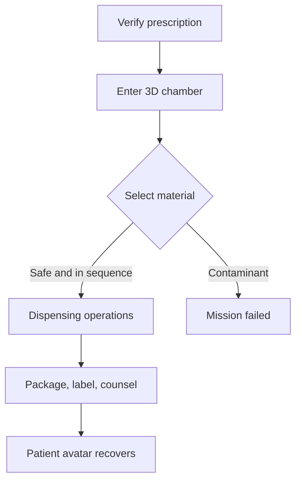

# Pharma Simulation

An interactive Three.js training game for **extemporaneous dispensing**. The first mission places a pharmacy learner inside a virtual compounding chamber where floating materials must be identified, sequenced, processed, packaged, and labeled while a hazardous contaminant tests safety judgment.

> Training software, not a validated compounding formula. Real quantities, patient-specific calculations, and clinical instructions are intentionally excluded.

## Play loop



The game is a single cohesive experience. Its rendering layer uses Three.js, while a framework-independent domain engine owns the rules, score, patient outcome, and auditable event sequence.

## Run locally

```bash
npm start
```

Open the URL printed by the local server. The renderer imports a pinned Three.js browser module. The game logic itself has no runtime dependency.

## Test

```bash
npm test
npm run check
```

The test suite verifies the safe completion route, contaminant failure, and order enforcement.

## Architecture

| Layer | Responsibility |
|---|---|
| `src/domain` | Mission definition and deterministic state machine |
| `src/web` | Three.js chamber, interaction, HUD, animation |
| `test` | Safety and progression invariants |
| `.github/workflows` | Tests, syntax checks, and Pages deployment |

## Roadmap

- pharmacist-reviewed mission content and assessment rubric
- multiple extemporaneous dosage-form missions
- accessibility mode without 3D motion
- learning analytics using privacy-preserving event summaries
- optional Filament renderer for high-fidelity native/mobile builds
- instructor dashboard and standards mapping

## Safety and scope

No player action should be treated as a real preparation method. Future clinical-learning content should pass pharmacist review, curriculum mapping, usability testing, and validation before classroom use.

## License

Source code is available under the MIT License. Educational content remains subject to review before real teaching deployment.
